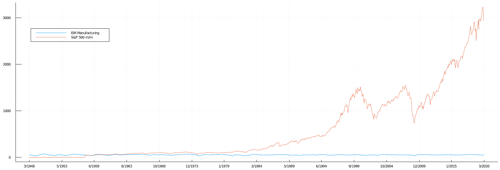
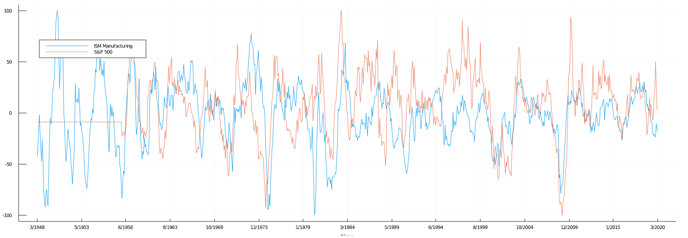

# MarketIndicators.jl

*by [Uki D. Lucas](https://www.linkedin.com/in/ukidlucas/)*

This project was started in August 2020 on [GitHub](https://github.com/UkiDLucas/MarketIndicators.jl)

<h1>Table of Contents<span class="tocSkip"></span></h1>
<div class="toc"><ul class="toc-item"><li><span><a href="#Overview" data-toc-modified-id="Overview-1"><span class="toc-item-num">1&nbsp;&nbsp;</span>Overview</a></span><ul class="toc-item"><li><span><a href="#Motivation" data-toc-modified-id="Motivation-1.1"><span class="toc-item-num">1.1&nbsp;&nbsp;</span>Motivation</a></span></li><li><span><a href="#Project-Objectives" data-toc-modified-id="Project-Objectives-1.2"><span class="toc-item-num">1.2&nbsp;&nbsp;</span>Project Objectives</a></span></li><li><span><a href="#Read-the-source,-Luke" data-toc-modified-id="Read-the-source,-Luke-1.3"><span class="toc-item-num">1.3&nbsp;&nbsp;</span>Read the source, Luke</a></span></li><li><span><a href="#What-are-Market-Indicators?" data-toc-modified-id="What-are-Market-Indicators?-1.4"><span class="toc-item-num">1.4&nbsp;&nbsp;</span>What are Market Indicators?</a></span></li><li><span><a href="#Why-using-Machine-Learning-and-not-spreadsheets?" data-toc-modified-id="Why-using-Machine-Learning-and-not-spreadsheets?-1.5"><span class="toc-item-num">1.5&nbsp;&nbsp;</span>Why using Machine Learning and not spreadsheets?</a></span></li><li><span><a href="#Machine-Learning-approach" data-toc-modified-id="Machine-Learning-approach-1.6"><span class="toc-item-num">1.6&nbsp;&nbsp;</span>Machine Learning approach</a></span></li><li><span><a href="#Why-Julia?" data-toc-modified-id="Why-Julia?-1.7"><span class="toc-item-num">1.7&nbsp;&nbsp;</span>Why Julia?</a></span></li></ul></li><li><span><a href="#Data-acquisition" data-toc-modified-id="Data-acquisition-2"><span class="toc-item-num">2&nbsp;&nbsp;</span>Data acquisition</a></span><ul class="toc-item"><li><span><a href="#Learn-about-market-indicators" data-toc-modified-id="Learn-about-market-indicators-2.1"><span class="toc-item-num">2.1&nbsp;&nbsp;</span>Learn about market indicators</a></span></li><li><span><a href="#Download-from-Yahoo-Finance" data-toc-modified-id="Download-from-Yahoo-Finance-2.2"><span class="toc-item-num">2.2&nbsp;&nbsp;</span>Download from Yahoo Finance</a></span></li><li><span><a href="#Download-from-mql5.com" data-toc-modified-id="Download-from-mql5.com-2.3"><span class="toc-item-num">2.3&nbsp;&nbsp;</span>Download from mql5.com</a></span></li></ul></li><li><span><a href="#Data-pre-processing" data-toc-modified-id="Data-pre-processing-3"><span class="toc-item-num">3&nbsp;&nbsp;</span>Data pre-processing</a></span><ul class="toc-item"><li><span><a href="#Reading-Data-from-CSV" data-toc-modified-id="Reading-Data-from-CSV-3.1"><span class="toc-item-num">3.1&nbsp;&nbsp;</span>Reading Data from CSV</a></span></li><li><span><a href="#Date-formatting" data-toc-modified-id="Date-formatting-3.2"><span class="toc-item-num">3.2&nbsp;&nbsp;</span>Date formatting</a></span><ul class="toc-item"><li><span><a href="#Explanation-of-terms" data-toc-modified-id="Explanation-of-terms-3.2.1"><span class="toc-item-num">3.2.1&nbsp;&nbsp;</span>Explanation of terms</a></span></li><li><span><a href="#the-&quot;y-m-d&quot;-date-format" data-toc-modified-id="the-&quot;y-m-d&quot;-date-format-3.2.2"><span class="toc-item-num">3.2.2&nbsp;&nbsp;</span>the "y-m-d" date format</a></span></li><li><span><a href="#the-&quot;y.m.d&quot;-date-format" data-toc-modified-id="the-&quot;y.m.d&quot;-date-format-3.2.3"><span class="toc-item-num">3.2.3&nbsp;&nbsp;</span>the "y.m.d" date format</a></span></li><li><span><a href="#the-&quot;u-d,-y&quot;-date-format" data-toc-modified-id="the-&quot;u-d,-y&quot;-date-format-3.2.4"><span class="toc-item-num">3.2.4&nbsp;&nbsp;</span>the "u d, y" date format</a></span></li></ul></li><li><span><a href="#Rata-Die-(days-since)" data-toc-modified-id="Rata-Die-(days-since)-3.3"><span class="toc-item-num">3.3&nbsp;&nbsp;</span>Rata Die (days since)</a></span></li><li><span><a href="#Populate-missing-indicators-with-previously-known-values" data-toc-modified-id="Populate-missing-indicators-with-previously-known-values-3.4"><span class="toc-item-num">3.4&nbsp;&nbsp;</span>Populate missing indicators with previously known values</a></span><ul class="toc-item"><li><span><a href="#Pseudo-Code" data-toc-modified-id="Pseudo-Code-3.4.1"><span class="toc-item-num">3.4.1&nbsp;&nbsp;</span>Pseudo Code</a></span></li><li><span><a href="#Code-Example" data-toc-modified-id="Code-Example-3.4.2"><span class="toc-item-num">3.4.2&nbsp;&nbsp;</span>Code Example</a></span></li></ul></li><li><span><a href="#Normalize-the-data" data-toc-modified-id="Normalize-the-data-3.5"><span class="toc-item-num">3.5&nbsp;&nbsp;</span>Normalize the data</a></span></li></ul></li></ul></div>

<hr />

## Overview


### Motivation

I started this project because I was interested, if given enough inputs, we can create an AI model to predict market movements.

Not too long ago, the prediction of the weather was a hit, or a miss. The joke was that the TV weather person was always carrying an umbrella on a supposedly nice day. Today, we can model the weather patterns very accurately for several days into the future.

Similarly, given enough relevant data, including market trends, human behavioral patterns, and current events, including the "black swan" events, we should be able to model the macro economics.

In words of someone very famous, the idea is to be "less wrong". Being better than average by few percent would have a big financial benefit.

This project is not meant to have a quick turnaround, but rather to be a labor of love towards my retirement, I have about 20 years. 

The plan is that every few days I add few new data sources and continue building the models until I get good at predicting something.

This article, and the open-source code, is not meant to teach you about market, not to teach you how to code, but rather to share my progress and to receive positive feedback and suggestions for improvement.

### Project Objectives

- gather and analyze as many market indicators as possible
- predict market trends 5, 30, or 90 days ahead 
- predict a particular stock price based on the market indicators
- maintain a stock portfolio by diversification using "hedge fund" principles
- produce a usable code and document the process

### Read the source, Luke

I am making changes to the open-source code in [GitHub repository](https://github.com/UkiDLucas/MarketIndicators.jl) daily.

The actual code may (and will) diverge from the examples below, hence "Read the source, Luke".

If you like my effort, "star" the GitHub project , it you find it useful, "Sponsor" it.

<a href="https://github.com/UkiDLucas/MarketIndicators.jl"></a>


### What are Market Indicators?

Market Indicators are **collections of data points** specific to a particular segment of the market, for example:
- "S&P 500" index show how major 500 stocks as a whole are performing
- "ISM Manufacturing" index shows how well the manufacturing industry is doing
- "GDP" index (Gross Domestic Product) shows how the country is doing
- etc., etc., etc.

There are hundreds, if not thousands, of such indicators.

### Why using Machine Learning and not spreadsheets?

The spreadsheets (i.e. Microsoft Excel, Apple Numbers, Google Sheets) and their graphing capability are the bread and butter of market analysis. They are great when comparing only a few indicators.

### Machine Learning approach

The overwhelming advantage of machine learning, or Artificial Intelligence (AI), is apparent when that we try to find subtle **patterns in thousands of indicators**. The human brain (using spreadsheets) fails to grasp the wealth of the information presented. 

The machine learning, on the other hand can easily detect the patterns in massive datasets and derive a conclusion.

### Why Julia?

- Julia is young, fast, elegant, multitasking and does the math extremely well, of course we are talking about [Julia programming language](https://docs.julialang.org/en/v1/)
- unlike C,C++, it is a pleasure to write and read Julia
- it is designed for scientific computing and machine learning
- similarly to C, it is extremely fast
- similar to Python, it is very easy to learn
- it is designed for parallelism
- it is designed for distributed computing

<hr />

## Data acquisition

### Learn about market indicators
- [indicators that move the market](https://www.investopedia.com/articles/fundamental-analysis/10/indicators-that-move-the-market.asp)

In this project, I started with a couple of dozen common market indicators and plan to expand to as many as I can find and use.

I have written a Julia [notebook](https://github.com/UkiDLucas/MarketIndicators.jl/blob/master/content/02%20Fetch%20Web%20Data.ipynb) that automatically fetched the data from the web and saves it locally as Comma Separated Value (.csv) spreadsheets.

### Download from Yahoo Finance

- [Yahoo Finance > Historical Data > Max](https://finance.yahoo.com/quote/%5EDJI/history?p=%5EDJI)
- [Apple AAPL - finance.yahoo.com]("https://finance.yahoo.com/quote/AAPL/history?p=AAPL")

The Yahoo Finance website is a great source of current and historical data for stocks and market indexes. 

### Download from mql5.com

-[mql5.com](https://www.mql5.com/en/economic-calendar/united-states)

This website is a great source for dozens of market indicators.

[back to top](#Table-of-Contents)

<hr />

## Data pre-processing

Since the data comes from the different sources, before the analysis, I have to check that it is formatted properly, if it has missing values, if the values are usable.

In fact, I work in a multi-national corporation that does not enforce common notation standards and I see a gamut of notations, some of which have very different meanings.

Some examples:

- 1 234 in USA are 2 separate numbers
- 1 234 is one thousand two hundred thirty four coming from Germany
- 1'234 is also sometimes seen in Europe for the above
- 1.234 in USA is a single decimal number one and two hundred thirty four thousands
- 1,234 is the same as above in Europe
- \$1.0 is one US buck
- 1,0$ is also one dollar, but I do not see many Americans recognizing it. 
- 2/12/12 is December 2, 2012, in Europe, but I would never advise anyone writing it this way.
- 12/2/12 is December 2, 2002, in USA, but I would never advise anyone writing it this way.
- 2012-12-01 is probably the most clear, logical and sortable way of writing the same date
- 1M is one million, but I see it being used for meters.
- 1m is one meter, but I see it being used for millions.
- 1s measures time (seconds)
- 1S measures electrical conductance (siemens)


The list could be long, very long.

The [**International System of Units**](https://en.wikipedia.org/wiki/International_System_of_Units) solves some of the above, but not all.

### Reading Data from CSV

As mentioned previously, I already saved many "original" Web data files locally as Comma Delimited Files (CSV).

Now, I read each file, convert to a Julia [DataFrame](https://github.com/JuliaData/DataFrames.jl) and pre-process them individually.

Please note that the function takes 3 parameters, all of them are optional. I usually provide only first 2 as the DATA directory is fixed.

```Julia

using DataFrames, CSV
function fetch_dataset( 
        file_name="TPLGX.csv", 
        date_format="yyyy.mm.dd", 
        dir="DATA\\original\\"
    )

    file_path = dir * file_name
    println(file_path)

    df = CSV.read(file_path, dateformat=date_format)
    df = sort(df, [:Date]);
    return df # DataFrame
end
```

### Date formatting

The dates, coming in the spreadsheets, especially these that are entered by hand, have a maddening array of possible formats.  

The task of getting all the dates to the same format is crucial as the market is all about dates.

Since I am using Julia language, I will be using [Dates module](https://docs.julialang.org/en/v1/stdlib/Dates/) terminology. 

```Julia 
    using Dates
    original_format = "d/m/y"
    Dates.Date("1/12/2021", original_format) 
    # results in "2021-12-01"
```

#### Explanation of terms

- **u**: 3 letter abbreviation of the month in English
- **d**: 1 or 2 digit day of the month
- **m**: 2 digit month
- **y**: 2 or 4 digit year, **note "50" results in "0050" and not "1950", or "2050"**

In the last one if the year is written as "yy" **a manual or programmatic fix may be needed**.


#### the "y-m-d" date format

The date format **I like** is "1950-05-31", or (yyyy-mm-dd) as it is **less error prone, logical, and easily sortable**. This also happens to be a default of Julia.

This format is also used by **Yahoo Finance** export.

```Julia 
    using Dates
    Dates.Date("1950-05-31", "y-m-d")
    # result: 1950-05-31
```

#### the "y.m.d" date format

This format is used by [MQL5.com economic calendar](https://www.mql5.com/en/economic-calendar), a primary source of indicator data.

```Julia 
    Dates.Date("1950.5.31", "y.m.d") 
    # result: 1950-05-31
```

#### the "u d, y" date format

As an example, the standard in USA is "Aug 31, 1950" (u d, y) 

```Julia 
    Dates.Date("May 31, 1950", "u d, y") 
    # result: 1950-05-31
```

<hr />

### Rata Die (days since)

Using dates is useful, but the market indicators are not updated on daily basis, most come out bi-weekly, monthly or event quarterly, inevitably, we will have some days that are "missing" in our datasets.

Counting and comparing dates is a messy business, it is better to assign an absolute Integer number to each day. 

We will use [Rata Die](https://en.wikipedia.org/wiki/Rata_Die), or the "days since" some fixed date in our data. 

```Julia

    col_ind = 1
    insertcols!(df, col_ind, :Rata_Die => zeros(Int64, record_count); makeunique = true )


    function update_rata_die!(df, days_column=1, date_column=2)
        rows = size(df)[1] # first part of the returned tupple

        for row = 1:rows
            df[row, days_column] = Dates.datetime2rata( Date(df[row, date_column]) ) 
        end
        return df
    end
```

<hr />

### Populate missing indicators with previously known values

#### Pseudo Code

- get value for the first row
- for each row starting at row 2
    - get the current value
        - if that value is missing
            - set it to the previous value if you have it
        - if you have current row value
            - set the previous to be equal to current

#### Code Example

Note: The actual code may diverge from the example below, hence "Read the source, Luke".

```Julia 
column = 6 # choose column to populate
previous_value = df[1, column]
rows = size(df)[1] # number of rows in the dataframe

for row in 2:rows # start with second row
    
    value = df[row, column] # get value for the current row
    
    if ismissing(value) # need to do something
        if ismissing(previous_value)
            # nothing to populate with, go to the next row
            continue
        else # we have a previous value
            df[row, column] = previous_value
        end
    else # we have a pre-existing indicator
        previous_value = value
    end
end
```

<hr />

### Normalize the data

Let's say we have two market indicators, one ranges from -1 to 1 and another from 0 to 100. Obviously it is not easy to compare them to see how they influence each other. 




Normalization is nothing else than "scaling" the data to be able to compare apples-to-apples.


