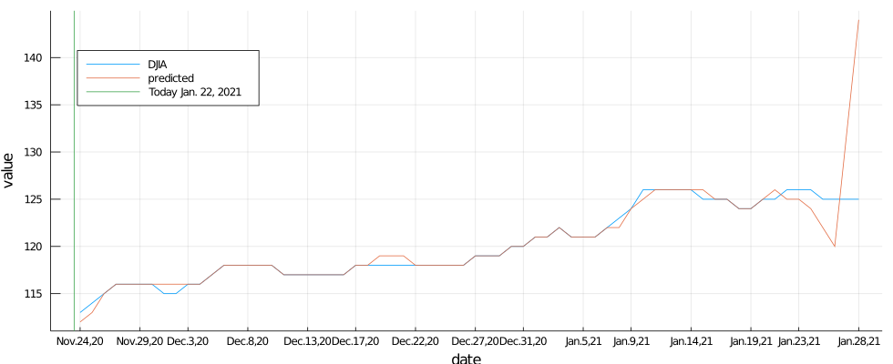
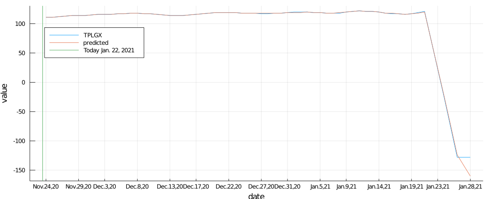
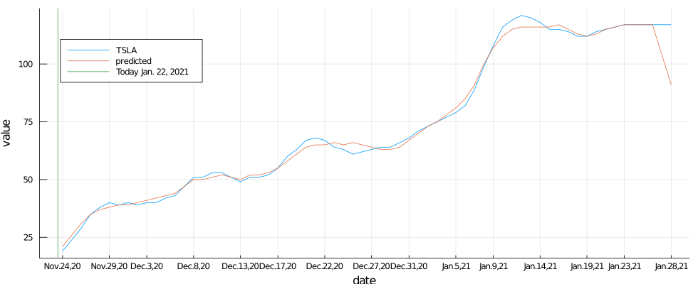

# Market Indicators machine learning with Julia.

*by [Uki D. Lucas](https://www.linkedin.com/in/ukidlucas/)*

- This project was started in August, 2020, on this [GitHub](https://github.com/UkiDLucas/MarketIndicators.jl).
- If you have a question to the author, contact [Uki D. Lucas](https://www.linkedin.com/in/ukidlucas/)  on LinkedIn.
- If you want to post a comment, please use [Discussions](https://github.com/UkiDLucas/MarketIndicators.jl/discussions).
- If you want to report bug, or submit a change request, use [Issue tracker](https://github.com/UkiDLucas/MarketIndicators.jl/issues).

<hr />

## Overview

I have asked myself a question: 

***Can we create an AI model to predict macro-economic trends?***

Spoiler alert: Yes. Maybe.


Please **read the story** on [UkiDLucas.medium.com](https://medium.com/datadriveninvestor/market-indicators-a-machine-learning-project-with-julia-language-be1a452213f8) before proceeding. Make sure you "star", "clap", "like", and share it.

<a href="https://github.com/UkiDLucas/MarketIndicators.jl"></a>


The [preditions](#Predictions) and [technical explanation](#Technical-Explanation) follow below.

## Disclaimer

I am neither a professional economist, nor a financial advisor, nor do I have ANY formal training in these subjects.
Any market predictions shown here are the outcome of automatic machine learning without any expert human supervision.

The **content is purely for your entertainment only**. 

<h1>Table of Contents<span class="tocSkip"></span></h1>
<div class="toc"><ul class="toc-item"><li><span><a href="#Overview" data-toc-modified-id="Overview-1"><span class="toc-item-num">1&nbsp;&nbsp;</span>Overview</a></span></li><li><span><a href="#Disclaimer" data-toc-modified-id="Disclaimer-2"><span class="toc-item-num">2&nbsp;&nbsp;</span>Disclaimer</a></span></li><li><span><a href="#Predictions" data-toc-modified-id="Predictions-3"><span class="toc-item-num">3&nbsp;&nbsp;</span>Predictions</a></span><ul class="toc-item"><li><span><a href="#AAPL" data-toc-modified-id="AAPL-3.1"><span class="toc-item-num">3.1&nbsp;&nbsp;</span>AAPL</a></span></li><li><span><a href="#BABA" data-toc-modified-id="BABA-3.2"><span class="toc-item-num">3.2&nbsp;&nbsp;</span>BABA</a></span></li><li><span><a href="#CRSP" data-toc-modified-id="CRSP-3.3"><span class="toc-item-num">3.3&nbsp;&nbsp;</span>CRSP</a></span></li><li><span><a href="#DJIA" data-toc-modified-id="DJIA-3.4"><span class="toc-item-num">3.4&nbsp;&nbsp;</span>DJIA</a></span></li><li><span><a href="#NVDA" data-toc-modified-id="NVDA-3.5"><span class="toc-item-num">3.5&nbsp;&nbsp;</span>NVDA</a></span></li><li><span><a href="#TPLGX" data-toc-modified-id="TPLGX-3.6"><span class="toc-item-num">3.6&nbsp;&nbsp;</span>TPLGX</a></span></li><li><span><a href="#TSLA" data-toc-modified-id="TSLA-3.7"><span class="toc-item-num">3.7&nbsp;&nbsp;</span>TSLA</a></span></li><li><span><a href="#VIX-index" data-toc-modified-id="VIX-index-3.8"><span class="toc-item-num">3.8&nbsp;&nbsp;</span>VIX index</a></span></li></ul></li><li><span><a href="#Technical-Explanation" data-toc-modified-id="Technical-Explanation-4"><span class="toc-item-num">4&nbsp;&nbsp;</span>Technical Explanation</a></span><ul class="toc-item"><li><span><a href="#Why-Julia?" data-toc-modified-id="Why-Julia?-4.1"><span class="toc-item-num">4.1&nbsp;&nbsp;</span>Why Julia?</a></span></li><li><span><a href="#Read-the-source,-Luke" data-toc-modified-id="Read-the-source,-Luke-4.2"><span class="toc-item-num">4.2&nbsp;&nbsp;</span>Read the source, Luke</a></span></li></ul></li><li><span><a href="#Running-the-Julia-code" data-toc-modified-id="Running-the-Julia-code-5"><span class="toc-item-num">5&nbsp;&nbsp;</span>Running the Julia code</a></span><ul class="toc-item"><li><span><a href="#Julia-in-terminal-on-MacOS" data-toc-modified-id="Julia-in-terminal-on-MacOS-5.1"><span class="toc-item-num">5.1&nbsp;&nbsp;</span>Julia in terminal on MacOS</a></span></li></ul></li><li><span><a href="#Data-acquisition" data-toc-modified-id="Data-acquisition-6"><span class="toc-item-num">6&nbsp;&nbsp;</span>Data acquisition</a></span><ul class="toc-item"><li><span><a href="#Downloading-from-the-Terminal" data-toc-modified-id="Downloading-from-the-Terminal-6.1"><span class="toc-item-num">6.1&nbsp;&nbsp;</span>Downloading from the Terminal</a></span></li><li><span><a href="#Learn-about-market-indicators" data-toc-modified-id="Learn-about-market-indicators-6.2"><span class="toc-item-num">6.2&nbsp;&nbsp;</span>Learn about market indicators</a></span></li><li><span><a href="#Download-stock-and-index-data-from-Yahoo-Finance" data-toc-modified-id="Download-stock-and-index-data-from-Yahoo-Finance-6.3"><span class="toc-item-num">6.3&nbsp;&nbsp;</span>Download stock and index data from Yahoo Finance</a></span></li><li><span><a href="#Download-market-indicator-data-from-mql5.com" data-toc-modified-id="Download-market-indicator-data-from-mql5.com-6.4"><span class="toc-item-num">6.4&nbsp;&nbsp;</span>Download market indicator data from mql5.com</a></span></li><li><span><a href="#Save-Downloaded-data-to-CSV-files" data-toc-modified-id="Save-Downloaded-data-to-CSV-files-6.5"><span class="toc-item-num">6.5&nbsp;&nbsp;</span>Save Downloaded data to CSV files</a></span><ul class="toc-item"><li><span><a href="#Examples-of-files" data-toc-modified-id="Examples-of-files-6.5.1"><span class="toc-item-num">6.5.1&nbsp;&nbsp;</span>Examples of files</a></span></li><li><span><a href="#Loop-that-saves-the-data" data-toc-modified-id="Loop-that-saves-the-data-6.5.2"><span class="toc-item-num">6.5.2&nbsp;&nbsp;</span>Loop that saves the data</a></span></li></ul></li></ul></li><li><span><a href="#Data-pre-processing" data-toc-modified-id="Data-pre-processing-7"><span class="toc-item-num">7&nbsp;&nbsp;</span>Data pre-processing</a></span><ul class="toc-item"><li><span><a href="#Reading-Data-from-CSV" data-toc-modified-id="Reading-Data-from-CSV-7.1"><span class="toc-item-num">7.1&nbsp;&nbsp;</span>Reading Data from CSV</a></span></li><li><span><a href="#Date-formatting" data-toc-modified-id="Date-formatting-7.2"><span class="toc-item-num">7.2&nbsp;&nbsp;</span>Date formatting</a></span><ul class="toc-item"><li><span><a href="#Explanation-of-terms" data-toc-modified-id="Explanation-of-terms-7.2.1"><span class="toc-item-num">7.2.1&nbsp;&nbsp;</span>Explanation of terms</a></span></li><li><span><a href="#the-&quot;y-m-d&quot;-date-format" data-toc-modified-id="the-&quot;y-m-d&quot;-date-format-7.2.2"><span class="toc-item-num">7.2.2&nbsp;&nbsp;</span>the "y-m-d" date format</a></span></li><li><span><a href="#the-&quot;y.m.d&quot;-date-format" data-toc-modified-id="the-&quot;y.m.d&quot;-date-format-7.2.3"><span class="toc-item-num">7.2.3&nbsp;&nbsp;</span>the "y.m.d" date format</a></span></li><li><span><a href="#the-&quot;u-d,-y&quot;-date-format" data-toc-modified-id="the-&quot;u-d,-y&quot;-date-format-7.2.4"><span class="toc-item-num">7.2.4&nbsp;&nbsp;</span>the "u d, y" date format</a></span></li></ul></li><li><span><a href="#Rata-Die-(days-since)" data-toc-modified-id="Rata-Die-(days-since)-7.3"><span class="toc-item-num">7.3&nbsp;&nbsp;</span>Rata Die (days since)</a></span></li><li><span><a href="#Populate-missing-indicators" data-toc-modified-id="Populate-missing-indicators-7.4"><span class="toc-item-num">7.4&nbsp;&nbsp;</span>Populate missing indicators</a></span><ul class="toc-item"><li><span><a href="#Pseudo-Code" data-toc-modified-id="Pseudo-Code-7.4.1"><span class="toc-item-num">7.4.1&nbsp;&nbsp;</span>Pseudo Code</a></span></li><li><span><a href="#Code-Example" data-toc-modified-id="Code-Example-7.4.2"><span class="toc-item-num">7.4.2&nbsp;&nbsp;</span>Code Example</a></span></li></ul></li><li><span><a href="#Normalize-the-data" data-toc-modified-id="Normalize-the-data-7.5"><span class="toc-item-num">7.5&nbsp;&nbsp;</span>Normalize the data</a></span><ul class="toc-item"><li><span><a href="#Code-Sample" data-toc-modified-id="Code-Sample-7.5.1"><span class="toc-item-num">7.5.1&nbsp;&nbsp;</span>Code Sample</a></span></li><li><span><a href="#Plotting-the-data" data-toc-modified-id="Plotting-the-data-7.5.2"><span class="toc-item-num">7.5.2&nbsp;&nbsp;</span>Plotting the data</a></span></li></ul></li><li><span><a href="#Calculating-averages" data-toc-modified-id="Calculating-averages-7.6"><span class="toc-item-num">7.6&nbsp;&nbsp;</span>Calculating averages</a></span></li><li><span><a href="#Save-DataFrame-as-CSV" data-toc-modified-id="Save-DataFrame-as-CSV-7.7"><span class="toc-item-num">7.7&nbsp;&nbsp;</span>Save DataFrame as CSV</a></span></li></ul></li><li><span><a href="#Combine-all-the-CVS-into-one-uber.cvs" data-toc-modified-id="Combine-all-the-CVS-into-one-uber.cvs-8"><span class="toc-item-num">8&nbsp;&nbsp;</span>Combine all the CVS into one uber.cvs</a></span></li><li><span><a href="#Train-the-model" data-toc-modified-id="Train-the-model-9"><span class="toc-item-num">9&nbsp;&nbsp;</span>Train the model</a></span><ul class="toc-item"><li><span><a href="#What-is-TuriCreate?" data-toc-modified-id="What-is-TuriCreate?-9.1"><span class="toc-item-num">9.1&nbsp;&nbsp;</span>What is TuriCreate?</a></span></li><li><span><a href="#Instal-TuriCreate" data-toc-modified-id="Instal-TuriCreate-9.2"><span class="toc-item-num">9.2&nbsp;&nbsp;</span>Instal TuriCreate</a></span><ul class="toc-item"><li><span><a href="#Using-Julia-PyCall-to-invoke-Python" data-toc-modified-id="Using-Julia-PyCall-to-invoke-Python-9.2.1"><span class="toc-item-num">9.2.1&nbsp;&nbsp;</span>Using Julia PyCall to invoke Python</a></span></li></ul></li><li><span><a href="#Read-uber.csv-as-SFrame" data-toc-modified-id="Read-uber.csv-as-SFrame-9.3"><span class="toc-item-num">9.3&nbsp;&nbsp;</span>Read uber.csv as SFrame</a></span></li><li><span><a href="#Split-training-and-testing-data" data-toc-modified-id="Split-training-and-testing-data-9.4"><span class="toc-item-num">9.4&nbsp;&nbsp;</span>Split training and testing data</a></span></li><li><span><a href="#Train-the-ML-model" data-toc-modified-id="Train-the-ML-model-9.5"><span class="toc-item-num">9.5&nbsp;&nbsp;</span>Train the ML model</a></span></li><li><span><a href="#Make-predictions" data-toc-modified-id="Make-predictions-9.6"><span class="toc-item-num">9.6&nbsp;&nbsp;</span>Make predictions</a></span></li></ul></li><li><span><a href="#Evaluate-Predictions" data-toc-modified-id="Evaluate-Predictions-10"><span class="toc-item-num">10&nbsp;&nbsp;</span>Evaluate Predictions</a></span></li><li><span><a href="#Conclusion" data-toc-modified-id="Conclusion-11"><span class="toc-item-num">11&nbsp;&nbsp;</span>Conclusion</a></span></li></ul></div>

## Predictions

Please read the [disclaimer](#Disclaimer) above.


### AAPL


### BABA


### CRSP


### DJIA



### NVDA


### TPLGX



### TSLA



### VIX index


## Technical Explanation

Long story short, I take a lot of features (i.e. indicators) and run machine model to predict a trend, or stock price for next few days.


### Why Julia?

- Julia is young, fast, elegant, multitasking, and does the math extremely well, of course we are talking about [Julia programming language](https://docs.julialang.org/en/v1/)
- unlike C/C++, it is a pleasure to read and write Julia
- it is designed for scientific computing and machine learning
- similarly to C, it is extremely fast
- similar to Python, it is very easy to learn
- it is designed for parallelism
- it is designed for distributed computing

### Read the source, Luke

In this notebook, I am including only the snippets of the code with represent a small and outdated portion of the actual code.

The repository code will diverge from the examples below, hence "Read the source, Luke", look at the actual code.

## Running the Julia code

I wrote all of the initial code in [Jupyter Lab](https://jupyter.org/) notebooks because it is easy to experiment with and easy to document. I absolutely love Jupyter notebooks for both Julia and Python. The page you are reading is also written in the JupyterLab notebook.

However, notebooks are slow to execute as each cell (i.e. paragraph) has to start, run and remember it's own state. 
The difference can be between a few milliseconds for the terminal vs a few seconds in the notebook, it is a 1,000-fold difference!

Hence, once I am happy with the code, I use the JupyterLab's "File > Download as.. > Julia (.jl)" option.
As the project progresses I expect to slowly migrate from notebooks to .jl files, currently, I use a free [Microsoft VS Code](https://code.visualstudio.com/Download) editor. 

You have two options:
- run the the notebooks to analyze the the code and my documentation
- run the Julia files for speed of the execution and future automation

### Julia in terminal on MacOS

```bash
# run once to create julia alias (symbolic link) on your system
$ echo "alias julia='/Applications/Julia-1.5.app/Contents/Resources/julia/bin/julia' " >> ~/.bash_profile
$ source ~/.bash_profile
# run a particular file
$ julia Update_Julia_packages.jl

Updating Julia packages.. this will take a few minutes!
```

<hr />

## Data acquisition

### Downloading from the Terminal

The [current code](https://github.com/UkiDLucas/MarketIndicators.jl/blob/master/src/Fetch_Web_Data.jl) fetches the indicators from the Web then goes to sleep for 4 hours.

```bash
$ julia Fetch_Web_Data.jl 

```

### Learn about market indicators

In this project, I started with a couple of dozen common market indicators and plan to expand to as many as I can find.

- [indicators that move the market](https://www.investopedia.com/articles/fundamental-analysis/10/indicators-that-move-the-market.asp)

I have written a Julia [notebook](https://github.com/UkiDLucas/MarketIndicators.jl/blob/master/content/02%20Fetch%20Web%20Data.ipynb) that automatically fetched the data from the web and saves it locally as Comma Separated Value (.csv) spreadsheets.

### Download stock and index data from Yahoo Finance

- [Yahoo Finance > Historical Data > Max](https://finance.yahoo.com/quote/%5EDJI/history?p=%5EDJI)
- [Apple AAPL - finance.yahoo.com]("https://finance.yahoo.com/quote/AAPL/history?p=AAPL")

The Yahoo Finance website is a great source of current and historical data for stocks and market indexes. 

### Download market indicator data from mql5.com

- [mql5.com economic calendar](https://www.mql5.com/en/economic-calendar/united-states)

This website is a great source for dozens of market indicators.

### Save Downloaded data to CSV files


#### Examples of files 


- 	[ADP Nonfarm Employment Change](https://query1.finance.yahoo.com/v7/finance/download/NVDA?period1=916963200&period2=1602028800&interval=1d&events=history)
-	[Alibaba Group Holding Limited (BABA)](https://query1.finance.yahoo.com/v7/finance/download/BABA?period1=1411084800&period2=1602633600&interval=1d&events=history&includeAdjustedClose=true)
-	[American Funds EuroPacific Growth Fund Class R-6 (RERGX)](https://query1.finance.yahoo.com/v7/finance/download/RERGX?period1=1241136000&period2=1602028800&interval=1d&events=history)
-	[Apple Inc. (AAPL)](https://query1.finance.yahoo.com/v7/finance/download/AAPL?period1=345427200&period2=1602028800&interval=1d&events=history)
-   [Bitcoin USD (BTC-USD)](https://query1.finance.yahoo.com/v7/finance/download/BTC-USD?period1=1410825600&period2=1602633600&interval=1d&events=history&includeAdjustedClose=true)
-	[CBOE Volatility Index (^VIX)](https://query1.finance.yahoo.com/v7/finance/download/%5EVIX?period1=631238400&period2=1602028800&interval=1d&events=history)
-	[Daily total sunspot number (http://www.sidc.be/)](http://www.sidc.be/silso/INFO/sndtotcsv.php)
-	[Dow Jones Industrial Average (^DJI)](https://query1.finance.yahoo.com/v7/finance/download/%5EDJI?period1=475804800&period2=1602028800&interval=1d&events=history&includeAdjustedClose=true)
-	[Federal Reserve Bank (Fed) of Dallas Manufacturing Index](https://www.mql5.com/en/economic-calendar/united-states/dallas-fed-manufacturing-business-index/export)
-	[Federal Reserve System (Fed) Industrial Production m/m](https://www.mql5.com/en/economic-calendar/united-states/industrial-production-mm/export)
-	[Federal Reserve System (Fed) Industrial Production m/m](https://www.mql5.com/en/economic-calendar/united-states/industrial-production-mm/export)
-   [Gold Dec 20 (GC=F)](https://query1.finance.yahoo.com/v7/finance/download/GC=F?period1=967593600&period2=1602028800&interval=1d&events=history)
-	[ISM Manufacturing Employment](https://www.mql5.com/en/economic-calendar/united-states/ism-manufacturing-employment/export)
-	[ISM United States Manufacturing Purchasing Managers Index (PMI)](https://www.mql5.com/en/economic-calendar/united-states/ism-manufacturing-pmi/export)
-	[Neuberger Berman Mid Cap Growth Fund Class R6 (NRMGX)](https://query1.finance.yahoo.com/v7/finance/download/NRMGX?period1=1363305600&period2=1602028800&interval=1d&events=history)
-	[NIO Limited (NIO)](https://query1.finance.yahoo.com/v7/finance/download/NIO?period1=1536710400&period2=1602633600&interval=1d&events=history&includeAdjustedClose=true)
-	[NVIDIA Corporation (NVDA)](https://query1.finance.yahoo.com/v7/finance/download/NVDA?period1=916963200&period2=1602028800&interval=1d&events=history)
-	[S&P 500 (^GSPC)](https://query1.finance.yahoo.com/v7/finance/download/%5EGSPC?period1=-1325635200&period2=1602028800&interval=1d&events=history)
-	[T. Rowe Price Institutional Large Cap Core Growth Fund (TPLGX)](https://query1.finance.yahoo.com/v7/finance/download/TPLGX?period1=1568730349&period2=1602028800&interval=1d&events=history)
-	[Tesla, Inc. (TSLA)](https://query1.finance.yahoo.com/v7/finance/download/TSLA?period1=1277769600&period2=1602028800&interval=1d&events=history)
-	[The Home Depot, Inc. (HD)](https://query1.finance.yahoo.com/v7/finance/download/HD?period1=369964800&period2=1602028800&interval=1d&events=history)
-	[Treasury Yield 10 Years (^TNX)](https://query1.finance.yahoo.com/v7/finance/download/%5ETNX?period1=-252374400&period2=1602028800&interval=1d&events=history)
-	[United States Building Permits](https://www.mql5.com/en/economic-calendar/united-states/building-permits/export)
-	[United States Gross Domestic Product (GDP) q/q](	https://www.mql5.com/en/economic-calendar/united-states/gross-domestic-product-qq/export)
-	[United States Housing Starts m/m](https://www.mql5.com/en/economic-calendar/united-states/housing-starts-mm/export)
-	[United States Initial Jobless Claims](https://www.mql5.com/en/economic-calendar/united-states/initial-jobless-claims/export)
-	[United States Pending Home Sales m/m](https://www.mql5.com/en/economic-calendar/united-states/pending-home-sales-mm/export)
-	[United States Unemployment Rate](https://www.mql5.com/en/economic-calendar/united-states/unemployment-rate/export)
-	[Vanguard Institutional Index Fund Institutional Shares (VINIX)](https://query1.finance.yahoo.com/v7/finance/download/VINIX?period1=649382400&period2=1602028800&interval=1d&events=history)
-	[Vanguard Total Bond Market Index Fund Admiral Shares (VBTLX)](https://query1.finance.yahoo.com/v7/finance/download/VBTLX?period1=1005523200&period2=1602028800&interval=1d&events=history)

#### Loop that saves the data

```Julia

row_count = size(df)[1]

while true
    println("============== ", Dates.DateTime(Dates.now() ), " ==============")
    
    for row in 1:row_count
        indicatior_name  = df[row, 1]
        file_name        = df[row, 2]
        url              = df[row, 3]
        if !isnothing(findfirst("finance.yahoo.com", url))
            url = update_yahoo_finance(url)
        end
        download( url , string(original_data_directory * file_name ) )
        println( "- downloaded: ", indicatior_name, " 
            -- ", file_name, "
            -- ", url ) 
        r_array = (rand(1)*9).+1  # 1.0.. to 9.9.. seconds
        r = r_array[1]
        sleep(r)            # to prevent being blocked
    end
    
    nap_time = 60*60*4 # seconds * minutes * hours
    println("going to sleep for ", nap_time/(60*60), " hours" )
    sleep(nap_time) 
end

```

[back to top](#Table-of-Contents)

<hr />

## Data pre-processing

Since the data comes from the different sources, before the analysis, I have to check that it is formatted properly, if it has missing values, if the values are usable.

In fact, I work in a multi-national corporation that does not enforce common notation standards and I see a gamut of notations, some of which have very different meanings.

Some examples:

- 1 234 in USA are 2 separate numbers
- 1 234 is one thousand two hundred thirty four coming from Germany
- 1'234 is also sometimes seen in Europe for the above
- 1.234 in USA is a single decimal number one and two hundred thirty four thousands
- 1,234 is the same as above in Europe
- \$1.0 is one US buck
- 1,0$ is also one dollar, but I do not see many Americans recognizing it. 
- 2/12/12 is December 2, 2012, in Europe, but I would never advise anyone writing it this way.
- 12/2/12 is December 2, 2002, in USA, but I would never advise anyone writing it this way.
- 2012-12-01 is probably the most clear, logical and sortable way of writing the same date
- 1M is one million, but I see it being used for meters.
- 1m is one meter, but I see it being used for millions.
- 1s measures time (seconds)
- 1S measures electrical conductance (siemens)


The list could be long, very long.

The [**International System of Units**](https://en.wikipedia.org/wiki/International_System_of_Units) solves some of the above, but not all.

### Reading Data from CSV

As mentioned previously, I already saved many "original" Web data files locally as Comma Delimited Files (CSV).

Now, I read each file, convert to a Julia [DataFrame](https://github.com/JuliaData/DataFrames.jl) and pre-process them individually.

Please note that the function takes 3 parameters, all of them are optional. I usually provide only first 2 as the DATA directory is fixed.

```Julia

using DataFrames, CSV
function fetch_dataset( 
        file_name="TPLGX.csv", 
        date_format="yyyy.mm.dd", 
        dir="DATA\\original\\"
    )

    file_path = dir * file_name
    println(file_path)

    df = CSV.read(file_path, dateformat=date_format)
    df = sort(df, [:Date]);
    return df # DataFrame
end
```

### Date formatting

The dates, coming in the spreadsheets, especially these that are entered by hand, have a maddening array of possible formats.  

The task of getting all the dates to the same format is crucial as the market is all about dates.

Since I am using Julia language, I will be using [Dates module](https://docs.julialang.org/en/v1/stdlib/Dates/) terminology. 

```Julia 
    using Dates
    original_format = "d/m/y"
    Dates.Date("1/12/2021", original_format) 
    # results in "2021-12-01"
```

#### Explanation of terms

- **u**: 3 letter abbreviation of the month in English
- **d**: 1 or 2 digit day of the month
- **m**: 2 digit month
- **y**: 2 or 4 digit year, **note "50" results in "0050" and not "1950", or "2050"**

In the last one if the year is written as "yy" **a manual or programmatic fix may be needed**.


#### the "y-m-d" date format

The date format **I like** is "1950-05-31", or (yyyy-mm-dd) as it is **less error prone, logical, and easily sortable**. This also happens to be a default of Julia.

This format is also used by **Yahoo Finance** export.

```Julia 
    using Dates
    Dates.Date("1950-05-31", "y-m-d")
    # result: 1950-05-31
```

#### the "y.m.d" date format

This format is used by [MQL5.com economic calendar](https://www.mql5.com/en/economic-calendar), a primary source of indicator data.

```Julia 
    Dates.Date("1950.5.31", "y.m.d") 
    # result: 1950-05-31
```

#### the "u d, y" date format

As an example, the standard in USA is "Aug 31, 1950" (u d, y) 

```Julia 
    Dates.Date("May 31, 1950", "u d, y") 
    # result: 1950-05-31
```

[back to top](#Table-of-Contents)

<hr />

### Rata Die (days since)

Using dates is useful, but the market indicators are not updated on daily basis, most come out bi-weekly, monthly or event quarterly, inevitably, we will have some days that are "missing" in our datasets.

Counting and comparing dates is a messy business, it is better to assign an absolute Integer number to each day. 

We will use [Rata Die](https://en.wikipedia.org/wiki/Rata_Die), or the "days since" some fixed date in our data. 

```Julia

    col_ind = 1
    insertcols!(df, col_ind, :Rata_Die => zeros(Int64, record_count); makeunique = true )


    function update_rata_die!(df, days_column=1, date_column=2)
        rows = size(df)[1] # first part of the returned tupple

        for row = 1:rows
            df[row, days_column] = Dates.datetime2rata( Date(df[row, date_column]) ) 
        end
        return df
    end
```

[back to top](#Table-of-Contents)

<hr />

### Populate missing indicators

Populate missing indicators with previously known values

#### Pseudo Code

- get value for the first row
- for each row starting at row 2
    - get the current value
        - if that value is missing
            - set it to the previous value if you have it
        - if you have current row value
            - set the previous to be equal to current

#### Code Example

```Julia 
column = 6 # choose column to populate
previous_value = df[1, column]
rows = size(df)[1] # number of rows in the dataframe

for row in 2:rows # start with second row
    
    value = df[row, column] # get value for the current row
    
    if ismissing(value) # need to do something
        if ismissing(previous_value)
            # nothing to populate with, go to the next row
            continue
        else # we have a previous value
            df[row, column] = previous_value
        end
    else # we have a pre-existing indicator
        previous_value = value
    end
end
```
[Read the source, Luke!](#Read-the-source,-Luke)

[back to top](#Table-of-Contents)

<hr />

### Normalize the data

This is also called "quantizing" the data.

I have chosen to quantize the data to the Int8 size, which are the values from -128 to 127.

This decision was made because of the Neural Network hardware I plan to run.

It is possible that -128 to 127 range does not provide sufficient resolution and it is a subject to change.

#### Code Sample

```Julia
function quantize_column!(df::DataFrame, column_number::Int64)
    original = df[:, column_number] # Array{Float64,1}
 
    min = minimum(original)
    max = maximum(original)
    #population_mean = mean(original)
    #standard_deviation = std(original)
    
    bias = (0 - min)/(max-min)
    println("bias for 0 value: ", bias)
    
    items = length(original)
    
    for i in 1:items
        #value = (original[i] - population_mean) / standard_deviation
        value = (original[i] -min)/(max-min)   # normalization formula to range 0.0 to 1.0
        #value = value + bias
        value = value * 255                    # 0.0 to 255
        value = value - 128                    # -128 to 127
        value = round(value, digits=0)         # 0.00 
        #value = convert(Int64, value)         # if DataFrame column is of type Float64, it will not save Int64
        df[i, column_number] = value
    end
    println("Normalization was performend using formula y=(((x-min)/(max-min))*255)-128 ") #TODO extract method
    println("minimum = $min")
    println("maximum = $max")
    println("Save these values for later to run model preditions")
    return (min, max)
end

```
[Read the source, Luke!](#Read-the-source,-Luke)

#### Plotting the data

```Julia
using Plots

count = size(df)[1]
rows = 1:count
dates = format_dates( df[rows,2] , "m/d/yy")

gr()
plot(          dates, # x-axis: dates
               [  df[rows,original_value_column]    ], # y-axis
    label    = [  columns[original_value_column] ""   ]  ,
    legend   =:topleft, 
              # :right, :left, :top, :bottom, :inside, :best, :legend, :topright, :topleft, :bottomleft, :bottomright
    xlabel   = "time",
    ylabel   = "indicators",
    size     = (980, 400), # width, height
    layout = (1, 1) # number of graphs: vertically, horizontally
    )

```
[Read the source, Luke!](#Read-the-source,-Luke)

Let's say we have two market indicators, one ranges from -1 to 1 and another from 0 to 100. Obviously it is not easy to compare them to see how they influence each other. 


Normalization is nothing else than "scaling" the data to be able to compare apples-to-apples.


### Calculating averages

The daily values, without a historical perspective are rather useless, hence every prediction should be based to the history.

```Julia

using DataFrames, Statistics

function calculate_average(df::DataFrame, average_days=90, column_to_average=3)
    record_count = size(df)[1]
    averages = zeros(Float64, record_count) # empty array
    
    for i in average_days:record_count
        day_this = df[i,1] # rata die 
        previous_interval_values = df[i-average_days+1:i, column_to_average]
        avg = round( mean(previous_interval_values) , digits=2) 
        averages[i] = avg
    end
    return averages
end

```

```Julia
column_to_average = 3
averages005 = calculate_average(df, 5,   column_to_average )
averages030 = calculate_average(df, 30,  column_to_average )
averages090 = calculate_average(df, 90,  column_to_average )
averages180 = calculate_average(df, 180, column_to_average )
averages365 = calculate_average(df, 365, column_to_average )

```

### Save DataFrame as CSV

```Julia
save_dataset(df, dataset_file_name );
```

[back to top](#Table-of-Contents)

<hr />

## Combine all the CVS into one uber.cvs

In this step we will take all the CSV files and combine into a single spreadsheet that we will use as the input to the machine learning model.

[back to top](#Table-of-Contents)

<hr />

## Train the model

I have tried a several options for Neural Network frameworks, here I will show the easiest one using TuriCreate.

### What is TuriCreate?

[TuriCreate](https://github.com/apple/turicreate) is an open-source machine learning framework for MacOS, Windows or Linux. I am using it because is very simple and takes advantage of the MacOS Radeon GPU.

### Instal TuriCreate

I install TuriCreate in conda env with Python 3.6 

```bash
conda create -n turi python=3.6 -y
conda activate turi

pip install turicreate

or

conda install -c derickl turicreate
```

I like to save my environment to a YML file and then re-create it as needed:

```bash

conda env export > environment_turi.yml

conda env create -f environment_turi.yml

conda activate turi

```

Then, I create a Jupyter notebook kernel using that environment:

```bash
python -m ipykernel install --user --name turi --display-name "Python 2.7 (turi)"
```

#### Using Julia PyCall to invoke Python

This may look strange that I am presenting a Python ML network in Julia, and I do have Julia wrapper around it, but the code in Julia and in Python looks almost the same.

```Julia

# This is Julia

using PyCall
tc = pyimport("turicreate")

data_path="./DATA/processed/uber.csv"
data = tc.SFrame(data_path)

train_data, test_data = data.random_split(0.8)

model = tc.regression.create( 
    train_data, 
    target = column_to_predict, 
    features = [ ...
```
As you can see calling Python from Julia works all the same.

I will continue with original Python description ...

### Read uber.csv as SFrame

```Python
# This is Python

data =  tc.SFrame(data_path)
```

### Split training and testing data

```Python
train_data, test_data = data.random_split(0.8)
```

### Train the ML model

```Python
model = tc.regression.create(
    train_data, 
    target = column_to_predict,
    features = [
         'DJIA_Avg005'
        ,'DJIA_Avg030'
        ,'DJIA_Avg090'
        ,'DJIA_Avg180'
        ,'DJIA_Avg365'
        
        ,'ISM_MFC_EMP_Avg090'
        ,'ISM_MFC_EMP_Avg180'
        ,'ISM_MFC_EMP_Avg365'
        
        ,'HOUSE_SRT_MM_Value'
        ,'HOUSE_SRT_MM_Avg090'
        ,'HOUSE_SRT_MM_Avg180'
        ,'HOUSE_SRT_MM_Avg365'
        
        ,'MFC_MPI_Value'
        ,'MFC_MPI_Avg090'
        ,'MFC_MPI_Avg180'
        ,'MFC_MPI_Avg365'
    ],
    validation_set='auto', 
    verbose=True
)
```

### Make predictions

```Python
predictions = model.predict(test_data)
```

[back to top](#Table-of-Contents)

<hr />

## Evaluate Predictions

```Python
results = model.evaluate( test_data )
```

Depending on what I am trying to predict, **I am getting results ranging from bad to dismal**, however sometimes all the planets align and I actually get good results:

- predicted  -127.43 , but actual value was  -127.0  difference is  0.43
- predicted  -121.17 , but actual value was  -121.0  difference is  0.17
- predicted  -119.97 , but actual value was  -120.0  **difference is  -0.03**
- predicted  -114.18 , but actual value was  -115.0  difference is  -0.82
- predicted  -112.17 , but actual value was  -112.0  difference is  0.17
- predicted  -109.18 , but actual value was  -110.0  difference is  -0.82
- predicted  -103.78 , but actual value was  -103.0  difference is  0.78
- predicted  -98.98 , but actual value was  -99.0  difference is  -0.02
- predicted  -84.58 , but actual value was  -85.0  difference is  -0.42
- predicted  -56.58 , but actual value was  -57.0  difference is  -0.42
- predicted  -42.03 , but actual value was  -42.0  difference is  0.03
- predicted  -41.35 , but actual value was  -42.0  difference is  -0.65
- predicted  -48.62 , but actual value was  -50.0  difference is  -1.38
- predicted  -49.98 , but actual value was  -50.0  difference is  -0.02
- predicted  -43.8 , but actual value was  -43.0  difference is  0.8
- predicted  -27.99 , but actual value was  -28.0  difference is  -0.01
- predicted  -25.77 , but actual value was  -26.0  difference is  -0.23
- predicted  -54.76 , but actual value was  -55.0  difference is  -0.24
- predicted  -34.98 , but actual value was  -35.0  difference is  -0.02
- predicted  -21.99 , but actual value was  -22.0  difference is  -0.01
- predicted  -2.63 , but actual value was  -2.0  difference is  0.63
- predicted  19.88 , but actual value was  20.0  difference is  0.12
- predicted  21.18 , but actual value was  22.0  difference is  0.82
- predicted  57.58 , but actual value was  58.0  difference is  0.42
- predicted  95.22 , but actual value was  97.0  difference is  1.78
- predicted  120.25 , but actual value was  118.0  difference is  -2.25


[back to top](#Table-of-Contents)

<hr />

## Conclusion

There is a small chance that this document can keep up with the code changes, however its real purpose was to get you interested in the project, maybe get in touch with me, and review and use the code.

I am also hoping that you will get interested in Julia language.

I fully realize that this is only a beginning of this project. Once it grows to hundreds of the input datasets and thousands of the input parameters, I truly believe it will provide accurate predictions for some of the macro-economic behaviors.

Respectfully,

[Uki D. Lucas](https://www.linkedin.com/in/ukidlucas/)


```julia

```
