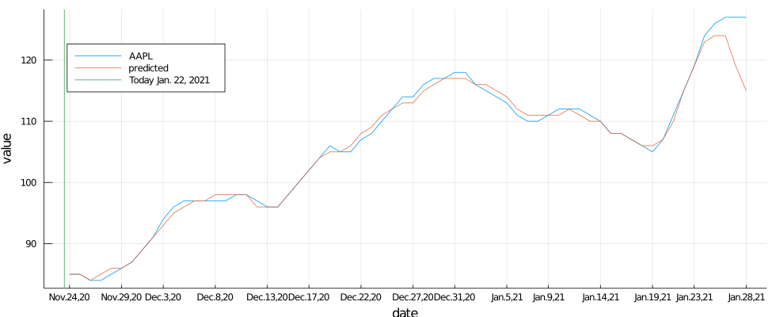
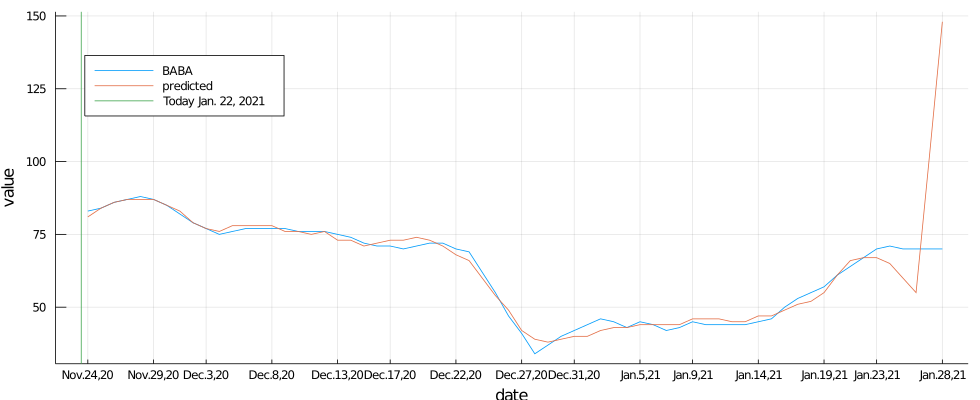
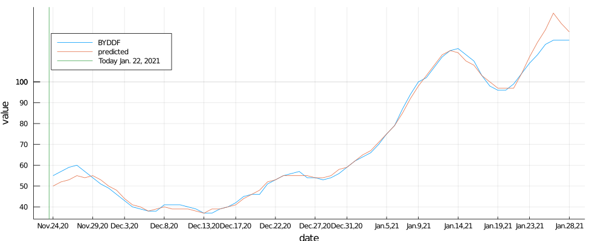
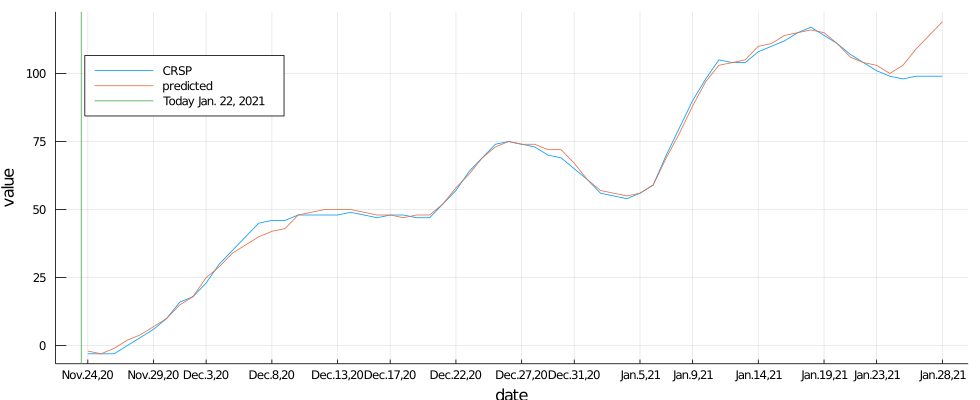
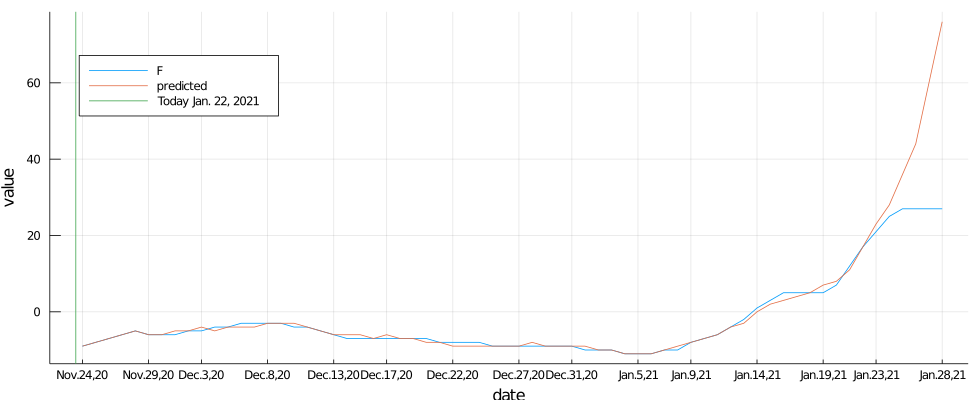
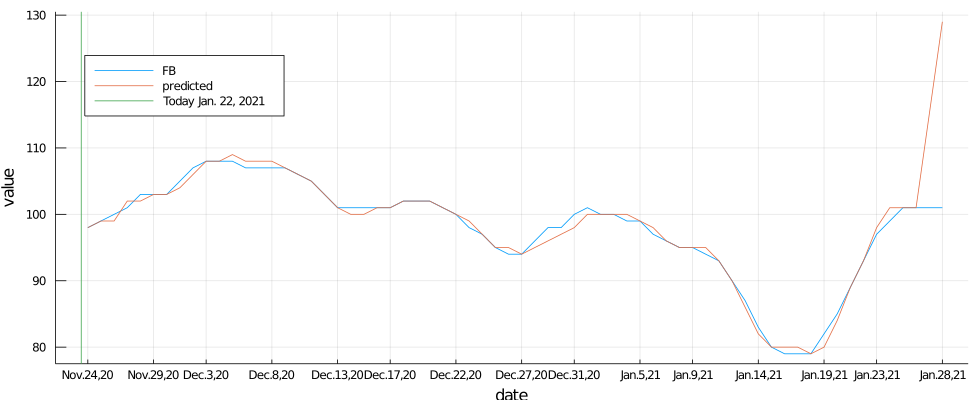
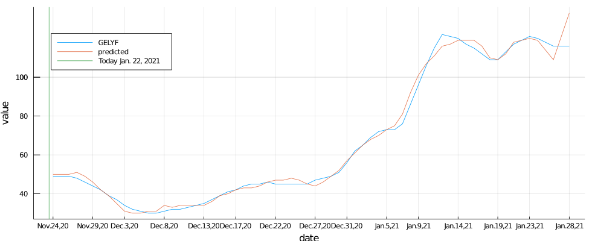
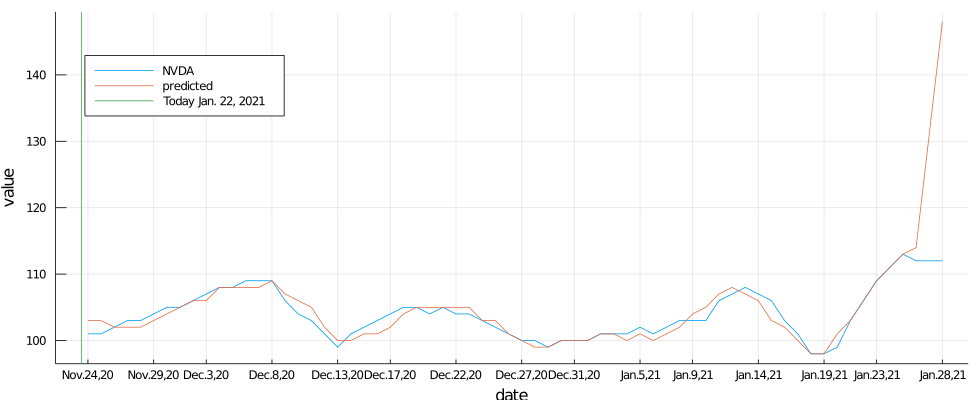
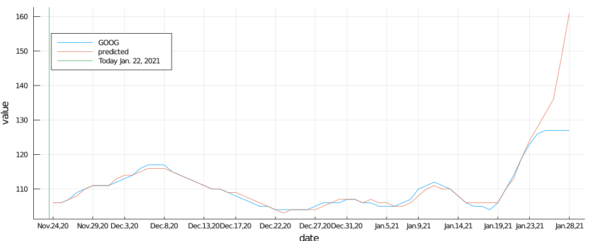
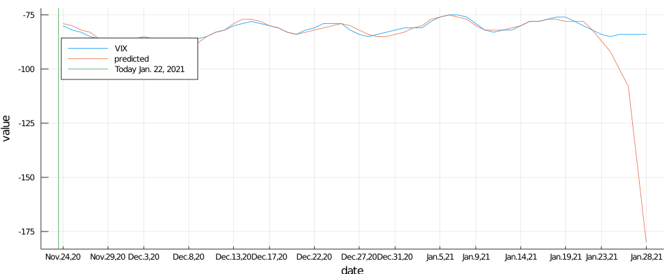

# Market Indicators machine learning with Julia.

*by [Uki D. Lucas](https://www.linkedin.com/in/ukidlucas/)*

## Motivation

This project was started in August, 2020, on [GitHub](https://github.com/UkiDLucas/MarketIndicators.jl).

I have been asking myself a question: ***Can I create an AI model to predict macro-economic trends?***

Spoiler alert: Yes, I can.


I have separated content in 3 parts because of potentially different audience and usage:
- 1. the [**background story**](https://medium.com/datadriveninvestor/market-indicators-a-machine-learning-project-with-julia-language-be1a452213f8) on [UkiDLucas.medium.com](https://ukidlucas.medium.com/)  for access to a wider audience, 
- 2. the [**actual predictions**](https://github.com/UkiDLucas/MarketIndicators.jl#predictions) to be viewed frequently,
- 3. the [**technical explanation**](https://github.com/UkiDLucas/MarketIndicators.jl/blob/master/Technical.ipynb) for these people more inclined.


If you like the content, make sure you "star", "clap", "like", and share it with your friends.

<a href="https://github.com/UkiDLucas/MarketIndicators.jl"></a>

## Disclaimer

I am neither a professional economist, nor a financial advisor, nor do I have ANY formal training in these subjects.
Any market predictions shown here are the outcome of automatic machine learning without any expert human supervision, hence **the prediction could be wrong and misleading**.

<h1>Table of Contents<span class="tocSkip"></span></h1>
<div class="toc"><ul class="toc-item"><li><span><a href="#Motivation" data-toc-modified-id="Motivation-1">Motivation</a></span></li><li><span><a href="#Disclaimer" data-toc-modified-id="Disclaimer-2">Disclaimer</a></span></li><li><span><a href="#Predictions" data-toc-modified-id="Predictions-3">Predictions</a></span><ul class="toc-item"><li><span><a href="#AAPL" data-toc-modified-id="AAPL-3.1">AAPL</a></span></li><li><span><a href="#BABA" data-toc-modified-id="BABA-3.2">BABA</a></span></li><li><span><a href="#BRK-B" data-toc-modified-id="BRK-B-3.3">BRK-B</a></span></li><li><span><a href="#BYDDF" data-toc-modified-id="BYDDF-3.4">BYDDF</a></span></li><li><span><a href="#CRSP" data-toc-modified-id="CRSP-3.5">CRSP</a></span></li><li><span><a href="#DJIA" data-toc-modified-id="DJIA-3.6">DJIA</a></span></li><li><span><a href="#FORD" data-toc-modified-id="FORD-3.7">FORD</a></span></li><li><span><a href="#FB" data-toc-modified-id="FB-3.8">FB</a></span></li><li><span><a href="#GELYF" data-toc-modified-id="GELYF-3.9">GELYF</a></span></li><li><span><a href="#NVDA" data-toc-modified-id="NVDA-3.10">NVDA</a></span></li><li><span><a href="#GOOG" data-toc-modified-id="GOOG-3.11">GOOG</a></span></li><li><span><a href="#TPLGX" data-toc-modified-id="TPLGX-3.12">TPLGX</a></span></li><li><span><a href="#TSLA" data-toc-modified-id="TSLA-3.13">TSLA</a></span></li><li><span><a href="#VIX-index" data-toc-modified-id="VIX-index-3.14">VIX index</a></span></li></ul></li><li><span><a href="#Feedback" data-toc-modified-id="Feedback-4">Feedback</a></span></li></ul></div>

## Predictions

Please read the [disclaimer](#Disclaimer) above.


### AAPL



### BABA



### BRK-B


### BYDDF



### CRSP



### DJIA


### FORD



### FB



### GELYF



### NVDA



### GOOG



### TPLGX


### TSLA


### VIX index



## Feedback

- If you have a question to the author, contact [Uki D. Lucas](https://www.linkedin.com/in/ukidlucas/)  on LinkedIn.
- If you want to post a comment, please use [Discussions](https://github.com/UkiDLucas/MarketIndicators.jl/discussions).
- If you want to report bug, or submit a change request, use [Issue tracker](https://github.com/UkiDLucas/MarketIndicators.jl/issues).


```julia

```
